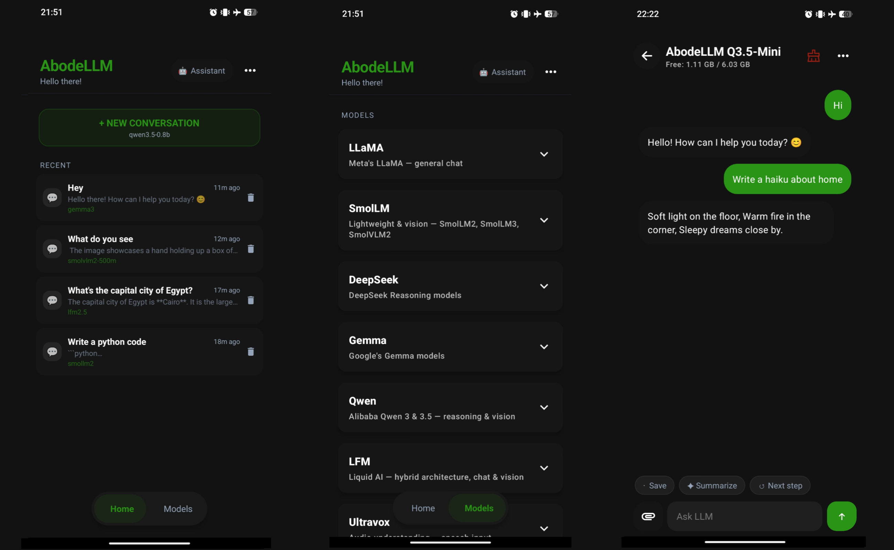

# 🏡 AbodeLLM

An offline AI assistant built for Android devices, based on open source models like LLaMA, Deepseek-R1-Qwen and SMOlLM2. It runs entirely on your device, ensuring privacy by processing everything locally. No internet connection is required for chat operations.

## ✨ Features

- 🔒 **Offline AI Processing**: Chat without internet access.
- 🛡️ **Privacy First**: All conversations are processed on-device.
- 💭 **Context Awareness**: Optional feature to retain conversation context *(beta)*.
- ⚙️ **Adjustable Settings**: Customize response behavior and context length *(under development)*.
- 📱 **Optimized for Mobile**: Designed to work efficiently on Android devices.

## 📱 Screenshots

## 📋 Version Info

- **Current Version**: `1.2.2`
- **Models Available**
  - `AbodeLLM_3.2` (LLaMA-3.2)
  - `AbodeLLM_R1` (DeepSeek-R1-Distill-Qwen)
  - `AbodeLLM_S2` (SmolLM2)
- **Required Android**: `8.0+` (Oreo)

## 💻 Requirements

| Component | Specification |
|-----------|--------------|
| Android   | 8.0 or higher |
| RAM       | 2GB minimum (8GB recommended) |
| Storage   | 800MB+ free space |

## 📥 Installation

### 1. Download the APK
   > Download the APK from [Releases](https://github.com/brendmung/abodellm/releases)

### 2. Install the APK
   > After downloading, install the APK file on your Android device.

### 3. Model Download
   > Select model to download. 
   > When prompted, allow the app to download the model (~from 750MB).  
   > For offline installation, see the [Manual Installation Guide](manual-install.md).

### 4. Start Chatting
   > Once the model is installed, reopen the app and begin your conversation!

📖 Manual Model Installation

 
If you prefer manual installation of the model, follow the instructions in the <a href="manual-install.md">Manual Installation Guide</a>.

## ⚠️ Important Notes

### Educational Use
- This app is intended for educational and personal use only
- Responses may be incomplete or inaccurate

### Technical Limitations
- Model generates a limited number of tokens at a time
- May produce shorter responses
- Performance depends on device capabilities

## 🐛 Known Issues

- Some responses may be incomplete
- Slower performance on devices with lower RAM or processing power

## 📢 Stay Updated

Join our channels for updates and discussions:
- [Telegram Channel](https://t.me/tricenc)
- [WhatsApp Channel](https://whatsapp.com/channel/0029ValNwp4I7BeEzI67Xp0i)

---

Made with ❤️ for the AI community

