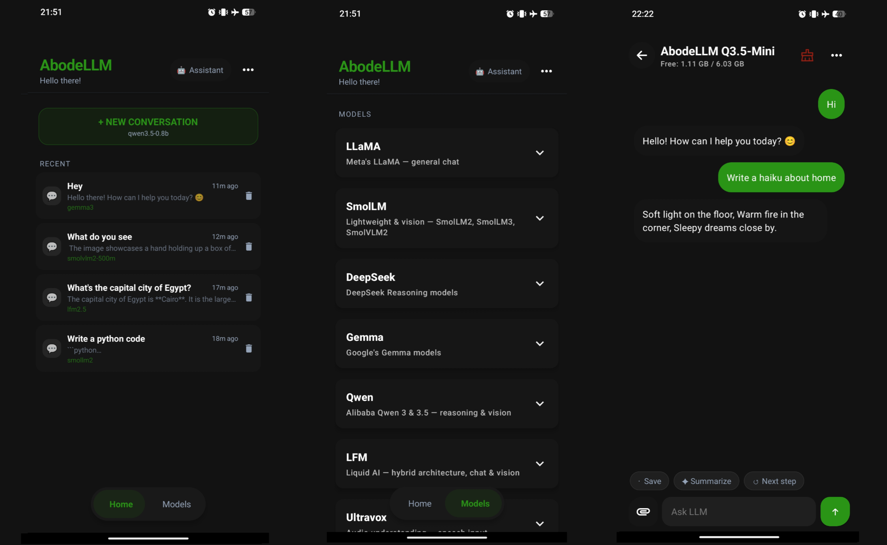

# 🏡 AbodeLLM

An offline AI assistant built for Android devices, based on open source models like LLaMA, DeepSeek R1 distill, SmolLM3, Qwen3, Gemma3, LFM2.5 and Ultravox. It runs entirely on your device, ensuring privacy by processing everything locally. No internet connection is required for chat operations.

## Features

- **Offline AI Processing**: Chat without internet access.
- **Privacy First**: All conversations are processed on-device.
- **Multimodal Input**: Vision and audio input on supported models.
- **Context Awareness**: Optional feature to retain conversation context.
- **Expert Mode**: Advanced settings with adjustable temperature, top-k/top-p, kv-cache and token limits.
- **Multiple Model Variants**: Choose from various model variants.
- **Optimized for Mobile**: Designed to work efficiently on Android devices.

## Screenshots

## Version Info

- **Current Version**: `3.0.0`
- **Models Available**
  - `LLaMA 3.2` — 1B, 1B Uncensored, 3B
  - `SmolLM2` — 135M, 1.7B, 1.7B Uncensored
  - `SmolLM3` — 3B
  - `SmolVLM2` — 256M, 500M, 2.2B *(Vision)*
  - `DeepSeek R1` — 1.5B
  - `Gemma 3` — 1B
  - `Qwen3` — 1.7B, 4B, 4B Abliterated
  - `Qwen3.5` — 0.8B, 2B *(Vision)*
  - `LFM2.5` — 1.5B, 1.5B Thinking
  - `LFM2.5-VL` — 1.5B *(Vision)*
  - `Ultravox` — 1B *(Audio)*

## Requirements

| Component | Specification |
|-----------|--------------|
| Android   | 9 or higher |
| RAM       | 3GB minimum (6GB+ recommended) |
| Storage   | 1GB+ free space |

## Installation

### 1. Download the APK
   > Download the APK from [Releases](https://github.com/brendmung/abodellm/releases)

### 2. Install the APK
   > After downloading, install the APK file on your Android device.

### 3. Model Download
   > Go to the **Models** tab and select a model to download. Models with a `+ Vision` or `+ Audio` badge support optional projector download for multimodal input — tap the badge when ready.

### 4. Start Chatting
   > Once the model is downloaded, start a new chat!

## Expert Mode

Expert Mode provides advanced users with fine-grained control over model behavior:

- **Temperature**: Control randomness in responses (0.0-1.0)
- **Top-K Sampling**: Limit vocabulary selection to top K tokens
- **Top-P Sampling**: Nucleus sampling for more coherent outputs
- **KV-Cache Management**: Context window size — 512 to 32768 tokens
- **Token Limits**: Maximum response length — 512 to 16384 tokens
- **Model Info**: View model architecture, layers, context length, quantization, and license
- **Import Model**: Load any external model (GGUF format supported), with optional projector for vision or audio input

How to Unlock Expert Mode

 

**To Enable Expert Mode:**
1. Open the app and navigate to **Settings** (via the inference page menu)
2. **Hold** the "Settings" title for 5 seconds until a confirmation dialog appears
3. The advanced controls will now be visible in your settings

**To Hide Expert Mode:**
- Simply **hold** the "Settings" title again for 5 seconds

## Important Notes

- Uncensored and abliterated model variants have fewer content restrictions — use responsibly
- KV cache changes apply on the next model load
- Performance depends on device capabilities

## Stay Updated

Join our channels for updates and discussions:
- [Telegram Channel](https://t.me/tricenc)
- [WhatsApp Channel](https://whatsapp.com/channel/0029ValNwp4I7BeEzI67Xp0i)

---

Simply Abode 🏡

