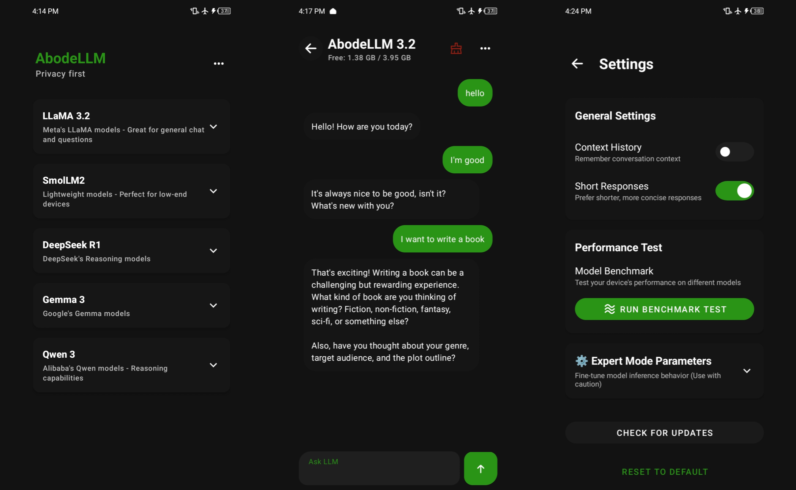

# 🏡 AbodeLLM

An offline AI assistant built for Android devices, based on open source models like LLaMA, Deepseek-R1-Qwen, SMOlLM2, Qwen3, and Google Gemma3. It runs entirely on your device, ensuring privacy by processing everything locally. No internet connection is required for chat operations.

## ✨ Features

- 🔒 **Offline AI Processing**: Chat without internet access.
- 🛡️ **Privacy First**: All conversations are processed on-device.
- 💭 **Context Awareness**: Optional feature to retain conversation context.
- ⚙️ **Expert Mode**: Advanced settings with adjustable temperature, top-k/top-p, kv-cache and token limits.
- 🎯 **Multiple Model Variants**: Choose from various model variants.
- 📱 **Optimized for Mobile**: Designed to work efficiently on Android devices.

## 📱 Screenshots

## 📋 Version Info

- **Current Version**: `2.0.0`
- **Models Available**
  - `AbodeLLM_3.2` (LLaMA-3.2)
  - `AbodeLLM_R1` (DeepSeek-R1-Distill-Qwen)
  - `AbodeLLM_S2` (SmolLM2)
  - `AbodeLLM_Q3` (Qwen3)
  - `AbodeLLM_G3` (Google Gemma3)
  - Multiple model variants available

## 💻 Requirements

| Component | Specification |
|-----------|--------------|
| Android   | 8.0 (Oreo) or higher |
| RAM       | 2GB minimum (8GB recommended) |
| Storage   | 800MB+ free space |

## 📥 Installation

### 1. Download the APK
   > Download the APK from [Releases](https://github.com/brendmung/abodellm/releases)

### 2. Install the APK
   > After downloading, install the APK file on your Android device.

### 3. Model Download
   > Select your preferred model and variant to download. 
   > For offline installation, see the [Manual Installation Guide](manual-install.md).

### 4. Start Chatting
   > Once the model is downloaded, restart the app and begin your conversation!

📖 Manual Model Installation

 
If you prefer manual installation of the model, follow the instructions in the <a href="manual-install.md">Manual Installation Guide</a>.

## ⚙️ Expert Mode

The new Expert Mode provides advanced users with fine-grained control over model behavior:

- **Temperature**: Control randomness in responses (0.0-1.0)
- **Top-K Sampling**: Limit vocabulary selection to top K tokens
- **Top-P Sampling**: Nucleus sampling for more coherent outputs
- **KV-Cache Management**: Optimize memory usage for longer conversations
- **Token Limits**: Set maximum response length

🔓 How to Unlock Expert Mode

 

**To Enable Expert Mode:**
1. Open the app and navigate to **Settings**
2. **Long press** on the "Settings" title at the top
3. Keep holding until a dialog appears confirming you've unlocked Expert Mode
4. The advanced controls will now be visible in your settings

**To Hide Expert Mode:**
- Simply **long press** the "Settings" title again
- Expert Mode will be hidden until you unlock it again

> **Note**: Expert Mode is designed for advanced users who understand model parameters. Use caution when adjusting these settings as they can significantly impact performance and response quality.

## ⚠️ Important Notes

### Educational Use
- This app is intended for educational and personal use only
- Responses may be incomplete or inaccurate

### Technical Limitations
- Model generates a limited number of tokens at a time
- May produce shorter responses
- Performance depends on device capabilities

## 🐛 Known Issues

- Some responses may be incomplete
- Slower performance on devices with lower RAM or processing power

## 📢 Stay Updated

Join our channels for updates and discussions:
- [Telegram Channel](https://t.me/tricenc)
- [WhatsApp Channel](https://whatsapp.com/channel/0029ValNwp4I7BeEzI67Xp0i)

---

Made with ❤️ for the AI community

